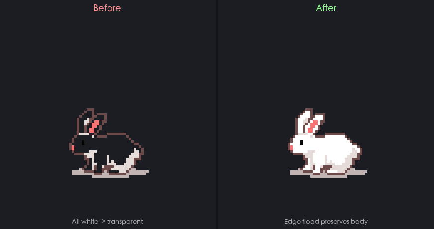
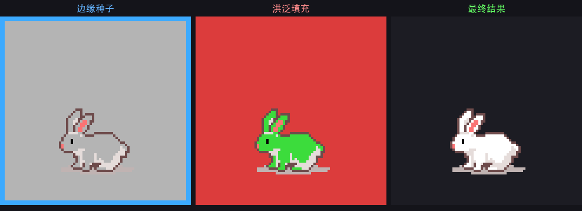
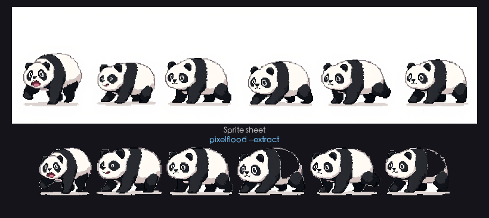

# 🌊 PixelFlood

[English](README.md) · [中文](README_zh.md) · [日本語](README_ja.md) · [한국어](README_ko.md) · [Français](README_fr.md) · [Español](README_es.md)

픽셀 아트를 위한 엣지 플러드 필 투명화 + 스프라이트 시트 분할 도구.

---

## 문제점

기존의 "흰색 배경 제거"는 **모든** 흰색 픽셀을 투명하게 만듭니다. 스프라이트의 흰색 디테일도 함께 사라집니다.

<p align="center"></p>

PixelFlood는 **이미지 가장자리**에서만 플러드를 시작합니다. 윤곽선이 제방처럼 내부의 흰색을 보호합니다.

---

## 알고리즘

<p align="center"></p>

| 단계 | 설명 |
|------|------|
| 가장자리 시드 | 네 가장자리에서 배경색 픽셀 검출 |
| 플러드 필 | BFS 4방향 확산, 윤곽선에서 정지 |
| 결과 | 가장자리와 연결된 배경만 투명 |

---

## 설치

```bash
pip install pixelflood
```

## 사용법

```bash
# 흰색 배경을 투명하게
pixelflood sprite.png

# 스프라이트 시트에서 개별 스프라이트 추출
pixelflood spritesheet.png --extract -o out/
```

<p align="center"></p>

```python
from PIL import Image
from pixelflood import flood, extract

# 단일 스프라이트: 배경 제거
result = flood(Image.open("sprite.png"))

# 스프라이트 시트: 개별 분리
sprites = extract(Image.open("spritesheet.png"), min_size=500)
for i, sprite in enumerate(sprites):
    sprite.save(f"sprite-{i+1}.png")
```

## 옵션

| 플래그 | 기본값 | 설명 |
|--------|-------|------|
| `-c, --color` | `#FFFFFF` | 배경색 |
| `-t, --threshold` | `7` | 채널당 허용 오차 |
| `--connectivity` | `4` | 플러드 방향 수 (`4` 또는 `8`) |
| `--crop` | 꺼짐 | 투명 테두리 자동 자르기 |
| `--margin` | `0` | 자르기 여백 |
| `--preview` | `0` | N배 프리뷰 저장 |
| `--extract` | 꺼짐 | 스프라이트 시트 분할 |
| `--min-size` | `100` | 추출 최소 픽셀 수 |

## License

MIT
